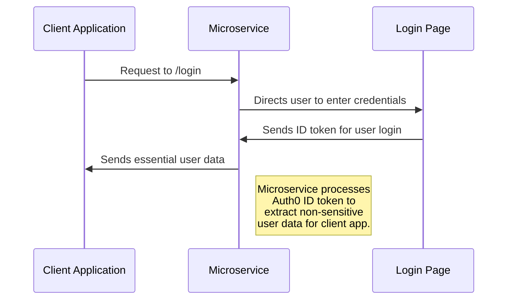
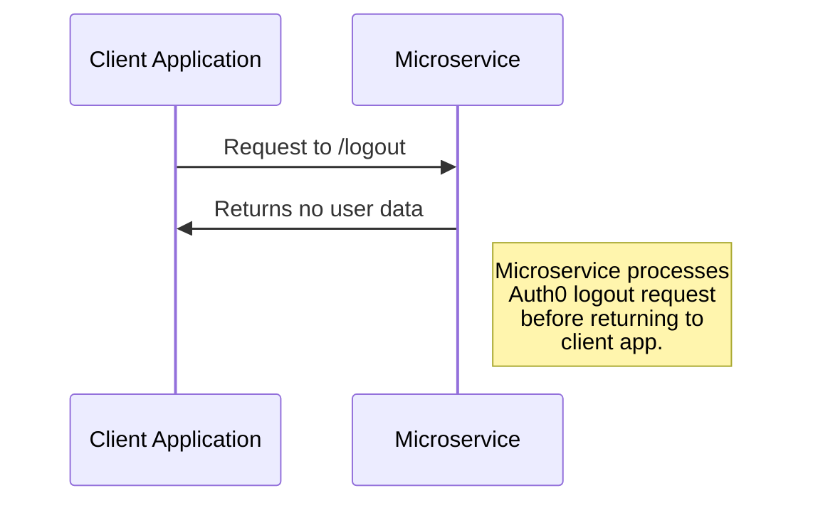

# CS 361 Login/Logout Microservice

**Microservice Endpoints** 
 This microservice is hosted on Google App Engine, where the base URL is http://cs361l.uw.r.appspot.com. The two endpoint are as follows:
> **/login:** the route to log a user in. Full URL http://cs361l.uw.r.appspot.com/login 
> **/logout:** the route to log a user out. Full URL http://cs361l.uw.r.appspot.com/logout
  

**Requesting data from this API** 
 The route to request user data is login (http://cs361l.uw.r.appspot.com/login). This is done via a GET request, but it has to be on the user's end, as they will have to enter their credentials. The user for your service should be directed to my URL, where they will be taken to a sign-in page. From there, they can create an account, log in with email, or use their Google/Microsoft/GitHub/Apple account for authentication.
 Logout also follows a similar flow, except users will not be required to interact with anything on the microservice endpoint to log out.
  
**Receiving data from this API** 
 As described, the /login route will take a user to sign in with their credentials. Following this, their login will be processed and their non-sensitive data will be claimed. This will be received by an endpoint on the client side, which is currently set to http://localhost:3000/callback (but can be set to any URL). This will include user data encoded as query parameters. The user data that is received will be in the following format:
  {
 &nbsp;&nbsp;"name:" (User's email or account name),
 &nbsp;&nbsp;"nickname:" (User's preferred name according to their account settings),
 &nbsp;&nbsp;"picture:" (URL to user's avatar image),
 &nbsp;&nbsp;"sub:" (The actual unique account ID generated by Auth0 to identify the user),
 }
  Logout does not return any data. Instead, it just handles logging out on the microservice and then redirects a user to http://localhost:3000 (which also can be set to any URL).
  
**Recommended API usage** 
 After receiving the data from a user that is logged in, there are a number of ways to store that login info. The following GitHub repository contains an example Express JS server that requests the data from http://cs361l.uw.r.appspot.com/login, then receives it at http://localhost:3000/callback. It uses localStorage to keep user data so a user stays logged in even after leaving the site, but there are many ways to do this. It also uses the http://cs361l.uw.r.appspot.com/logout endpoint to log a user out. This is a simple example, so other implementations may not be exactly the same:   https://github.com/kopatsis/CS361MicroserviceExample

 
<h1>UML Diagrams</h1>

**Login** 

**Logout** 

